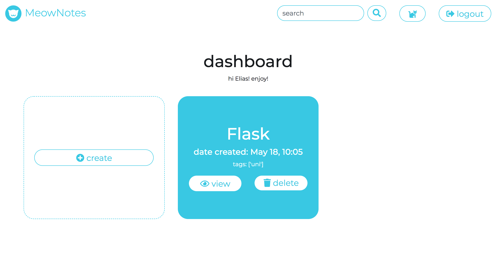
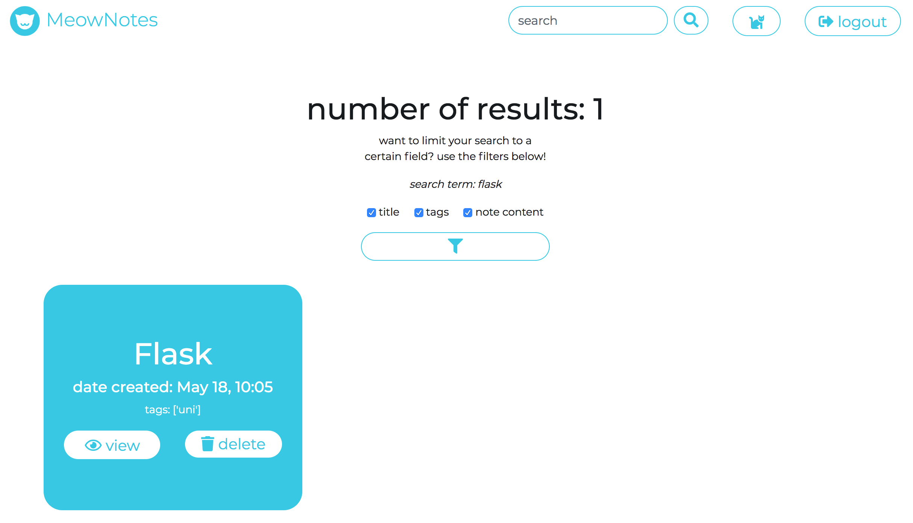

[](https://www.python.org/)

# MeowNotes

The note-taking app for cat lovers.

See MeowNotes live at: http://ekhattar.pythonanywhere.com/

For more details, [see the technical paper in the wiki](https://github.com/ekhattar/MeowNotes/wiki/Technical-Paper).

## About

MeowNotes is a Python-based web app written with [Flask](http://flask.pocoo.org/) and an [SQLite](https://www.sqlite.org/index.html) database.

It can be run on the [uWSGI](https://uwsgi-docs.readthedocs.io/en/latest/) server that implements the [WSGI python server specification](https://en.wikipedia.org/wiki/Web_Server_Gateway_Interface).

The live version of MeowNotes is deployed and hosted from [pythonanywhere](http://pythonanywhere.com).

For local development, the [make](https://www.gnu.org/software/make/) utility provides an easy way to setup MeowNotes with predefined commands.

With regards to quality, testing is done with [pytest](https://docs.pytest.org/en/latest/) and [pylint](https://www.pylint.org/) is used for static code checks.

MeowNotes makes use of the following: [Bootstrap](https://getbootstrap.com/docs/4.3/getting-started/introduction/), [Font Awesome](https://fontawesome.com/), and [Cat as a Service](https://cataas.com/#/).


__Structure of this repo__

```
.
├── Makefile                                                    "shortcut" tasks to setup and run MeowNotes
├── README.md                                                   primary info on how to setup, run, etc
├── documentation
│   ├── "SS2019 - SE 01 Final Project - Concept.pdf"            first concept ideation for the project
│   ├── diagrams                                                technical diagrams of MeowNotes
│   │   └── ...
│   ├── flask-routes.png                                        screenshot of flask routes output
│   └── screenshots                                             screenshots of MeowNotes pages
│       └── ...
├── meownotes                                                   main app directory
│   ├── __init__.py                                             main Flask app file
│   ├── config.py                                               app configuration
│   ├── dbquery.py                                              main backend file to communicate with db
│   ├── meownotes-schema.sql                                    schema showing structure of MeowNotes db
│   ├── meownotes.db                                            SQLite3 db
│   ├── pawprint.py                                             Flask blueprint for MeowNotes app
│   ├── static                                                  static files
│   │   ├── css                                                 styling
│   │   │   ├── bootstrap-4.3.1                                 Bootstrap CSS
│   │   │   │   └── ...
│   │   │   ├── fonts.css                                       custom font imports
│   │   │   └── main.css                                        MeowNotes custom css
│   │   ├── fonts                                               custom font (Montserrat) files
│   │   │   └── ...
│   │   ├── img                                                 MeowNotes image assets (logo, favicon)
│   │   │   └── ...
│   │   └── js                                                  js
│   │       ├── bootstrap-4.3.1                                 Bootstrap JS
│   │       │   └── ...
│   │       ├── jquery-3.3.1.slim.min.js                        Bootstrap JS dependency
│   │       ├── main.js                                         MeowNotes custom js
│   │       └── popper.min.js                                   Bootstrap JS dependency
│   ├── templates                                               MeowNotes HTML templates
│   │   └── ...
│   ├── test                                                    test folder
│   │   └── ...
│   └── utils.py                                                additional helper functions for MeowNotes
├── venv                                                        (virtual environment, not committed to repo)
│   └── ...
├── .pylintrc                                                   config file for pylint
└── wsgi.py                                                     uWSGI server configuration file

```

## Prerequisites

- python3
- virtualenv

```bash
pip3 install virtualenv
```
- recommended: [make](https://www.gnu.org/software/make/)
  - needed only if want to use the tasks defined in the `Makefile` as shortcuts

## Setup

General setup

```bash
# Clone the repo
git clone https://github.com/ekhattar/MeowNotes.git
# Change directory
cd MeowNotes
```

After this point, you have two options.

You can setup the environment for MeowNotes using `make` if you have it:

```bash
# in the MeowNotes dir
make install
```

You can also do everything without `make`:

```bash
# Create the virtual env
python3 -m venv venv
# Start the virtual env
source venv/bin/activate
# Install flask and other dependencies in the virtual env
pip install flask
pip install python-dateutil
# Optional: install if want to run with wsgi server locally
pip install uwsgi
# Dev dependency only for testing
pip install pytest
pip install pylint
```

(Re)create the database; __danger__, will delete existing contents and create new tables!

```bash
# Option 1: using make
make fresh-db
# Option 2: without using make
# Start the virtual env
source venv/bin/activate
export FLASK_APP=meownotes
flask initdb
```

## Start MeowNotes locally

### Dev/debug mode 

This mode has live reload on change as well as additional logging output in the console including the prepared SQL queries and results; can use either `make` or "manually" run the necessary commands to start.

See MeowNotes at [localhost:5000/](http://localhost:5000/).

Start dev/debug mode with `make`:

```bash
# In the MeowNotes folder
make run-debug
```

Start manually:

```bash
# Start the virtual env
source venv/bin/activate
# Set env var to see extra debug output
export MEOWNOTES_DEBUG=True
# Start in debug mode (live reload on change)
python3 meownotes/__init__.py
```

### "Production" mode

This mode suppresses the additional logging output and starts on a different port.

See MeowNotes at [localhost:8000/](http://localhost:8000/).

This port is defined in the `Makefile` and can be changed there.

Start with `make`:

```bash
# In the MeowNotes folder
make run-prod
```

Start manually:

```bash
# Start the virtual env
source venv/bin/activate
# Start the app
export FLASK_APP=meownotes
flask run
```

Using the uWSGI server:

```bash
# In the MeowNotes folder
make run-wsgi
```

### Testing and code quality

Tests are found in `meownotes/tests`; run like so:

```bash
# in the root folder MeowNotes
make test
```

To use `pylint` (configured in the `.pylintrc` file):

```bash
# in the root folder MeowNotes
make lint
```

## Features

- __sign up / login__ (from the landing)
- __logout__ (from the menu bar)
- __view a random cat__ (from the menu bar)
- __create__ a new note with a title, tags, and content (from the dashboard)
- __edit__ an existing note (from the single note view)
- __delete__ an existing note (from the dashboard, search, or single note view)
- __download__ an existing note (from the single note view)
- __search__ for a note by its title, tags, and/or content (from the menu bar)
- __filter__ the search to limit to a specific field (from the search results page)

### Screenshots

#### Landing (login / sign-up)


#### Dashboard


#### Create a note


#### View a note


#### Edit a note


#### Downloaded note


#### Deleted note and example notification


#### View a random cat


#### Search for notes and filter search


### Routes

You can use `make` to see the routes defined:

```bash
make see-routes
```

Here is a more detailed description:

- `/`
    - `GET` show the langing (login/sign-up page)
- `/cat`
    - `GET` show the cat page with a random cat
- `/login`
    - `GET` redirect to the dashboard if signed in
    - `POST` either login or create a new account; if password is wrong for an existing account, the landing page is rerendered with the warning message; if the password is right or a new account is created, redirect to the dashboard
- `/logout`
    - `GET` remove the username from the session and redirect to the landing
- `/dashboard`
    - `GET` show the dashboard page with the user's notes
- `/view`
    - `GET` show the view page for the given note by id
- `/download`
    - `GET` note data sent as raw text file to download
- `/update`
    - `GET` redirect to the `/view` page for this note
    - `POST` (DB) update the note with the given id from the form
- `/create`
    - `GET` show the create page
    - `POST` (DB) create a new note
- `/delete`
    - `GET` redirect to dashboard
    - `POST` (DB) delete the note with the given id from the form
- `/search`
    - `GET` show empty search results page
    - `POST` show populated search results
- `/filter`
    - `GET` redirect to (empty) search results page
    - `POST` render search results with filters applied

_Note_: all `GET` requests additionally to the above redirect to the landing (login page) if the user is not logged in

## References

- Flask documentation
  - database connection: http://flask.pocoo.org/docs/1.0/tutorial/database/
  - blueprints: http://flask.pocoo.org/docs/1.0/tutorial/views/
  - testing: http://flask.pocoo.org/docs/1.0/testing/
