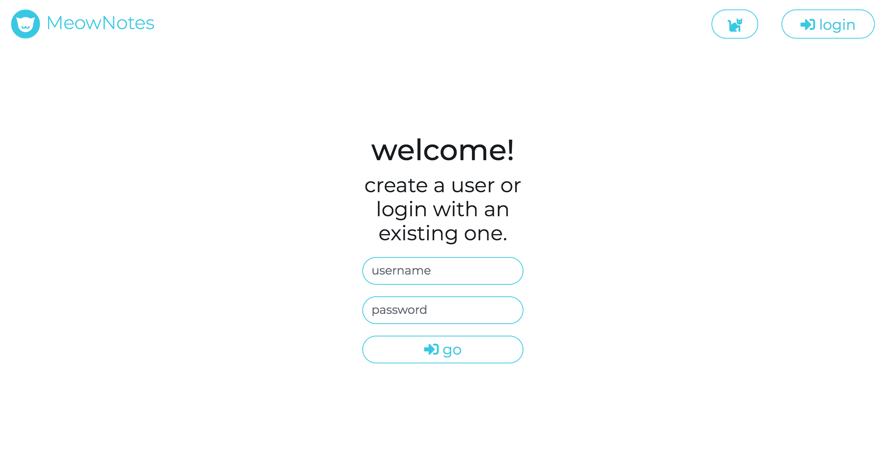

# MeowNotes

The note-taking app for cat lovers.

## About

MeowNotes is a Python-based web app written with [Flask](http://flask.pocoo.org/) and an [SQLite](https://www.sqlite.org/index.html) database.

Additionally, MeowNotes makes use of the following: [Bootstrap](https://getbootstrap.com/docs/4.3/getting-started/introduction/), [Font Awesome](https://fontawesome.com/), [Google Fonts](https://fonts.google.com/), and [Cat as a Service](https://cataas.com/#/).

Structure of this repo:

```bash
|--documentation    basic documentation
|--meownotes        main source code directory including SQLite db
|----static         assets for the flask app
|------css          custom & bootstrap css files
|------img          image assets for MeowNotes
|------js           custom & bootstrap + dependencies js files
|----templates      html templates for the flask app
```

## Prerequisites

- make
- python3
- virtual env

```bash
pip3 install virtualenv
```

## Setup

```bash
# Clone the repo
git clone https://github.com/ekhattar/MeowNotes.git
# Change directory
cd MeowNotes
# Create the virtual env
python3 -m venv venv
# Start the virtual env
source venv/bin/activate
# Install flask and other dependencies in the virtual env
pip install flask
pip install python-dateutil
```

## Start MeowNotes locally

Dev/debug mode (live reload on change)

(shortcut)
```bash
# in the MeowNotes folder
make run-debug
```

```bash
# Start the virtual env
source venv/bin/activate
# Set env var to see extra debug output
export MEOWNOTES_DEBUG=True
# Start in debug mode (live reload on change)
python3 meownotes/__init__.py
```

"Production" mode

(shortcut)
```bash
# in the MeowNotes folder
make run-prod
```

```bash
# Start the virtual env
source venv/bin/activate
# Start the app
export FLASK_APP=meownotes/__init__.py
flask run
```

See MeowNotes at [localhost:5000/](http://localhost:5000/)

## Features

- __sign up / login__ (from the landing)
- __logout__ (from the menu bar)
- __view a random cat__ (from the menu bar)
- __create__ a new note with a title, tags, and content (from the dashboard)
- __edit__ an existing note (from the single note view)
- __delete__ an existing note (from the dashboard, search, or single note view)
- __download__ an existing note (from the single note view)
- __search__ for a note by its title, tags, and/or content (from the menu bar)
- __filter__ the search to limit to a specific field (from the search results page)

### Screenshots

#### Landing (login / sign-up)


#### Dashboard


#### Create a note


#### View a note


#### Edit a note


#### Downloaded note


#### View a random cat


### Routes

- `/`
    - `GET` show the langing (login/sign-up page)
- `/cat`
    - `GET` show the cat page with a random cat
- `/login`
    - `GET` redirect to the dashboard if signed in
    - `POST` either login or create a new account; if password is wrong for an existing account, the landing page is rerendered with the warning message; if the password is right or a new account is created, redirect to the dashboard
- `/logout`
    - `GET` remove the username from the session and redirect to the landing
- `/dashboard`
    - `GET` show the dashboard page with the user's notes
- `/view`
    - `GET` show the view page for the given note by id
- `/download`
    - `GET` note data sent as raw text file to download
- `/update`
    - `GET` redirect to the dashboard
    - `POST` (DB) update the note with the given id from the form
- `/create`
    - `GET` show the create page
    - `POST` (DB) create a new note
- `/delete`
    - `GET` redirect to dashboard
    - `POST` (DB) delete the note with the given id from the form
- `/search`
    - GET: show empty search results page
    - POST: show populated search results
- `/filter`
    - GET: redirect to (empty) search results page
    - POST: render search results with filters applied

_Note_: all `GET` requests additionally to the above redirect to the landing (login page) if the user is not logged in

